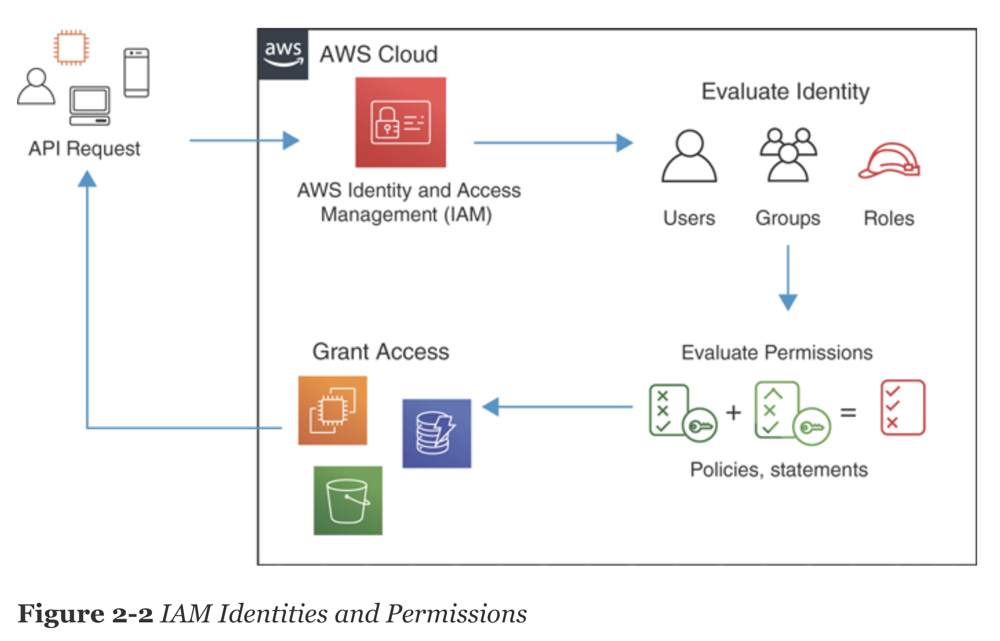

# Chapter 2

## QUIZ

1. When using IAM, to which of the following IAM principles can you assign long-term credentials?

    * User

    * Group

    * Role

    * Policy

2. When delivering federated access to an application, how does the user gain access to AWS services?

    * Via delegated policy based on the user’s group or pool membership

    * Via role assumption based on the user’s group or pool membership

    * Via federated policy based on the user’s group or pool membership

    * Via shared role based on the user’s group or pool membership

3. When assigning strict permissions for accessing S3 to a mobile application, how could you lock down the permissions to exactly one action?

    * Allow the action in the bucket policy for all users. All other actions are implicitly denied.

    * Allow the action in the bucket policy for all users. Explicitly deny all other actions by using a “Not” condition.

    * Allow the action in the role policy. All other actions are implicitly denied.

    * Allow the action in the role policy. Explicitly deny all other actions by using a “Not” condition.

4. Encryption in transit can be achieved through which of the following?

    * TLS

    * Client-side encryption

    * IPsec VPN

    * All of these answers are correct.

5. You are writing code for a mobile application. You need to allow the application to access an S3 bucket. What would be the most secure way to access the AWS resource?

    * Create an ACL and apply it to the bucket. Create a bucket policy that allows the ACL access to the bucket.

    * Create an IdP that authenticates the user of the application and provides it with a role. Create a bucket policy that allows the role access to the bucket.

    * Create an IdP that authenticates the user of the application and provides it with a role. Create an IAM policy with access to S3 and attach it to the role.

    * Authenticate the user of the application through IAM and provide it with a role. Create an IAM policy with access to S3 and attach it to the role.

6. To allow an application on an EC2 instance to use S3, which of the following is the safest way to distribute credentials?

    * Using secret access key and access key ID in the ./aws/credentials file

    * Storing credentials in the code

    * Using the environment variables

    * Using a role

7. For which of the following can you use IAM? (Choose all that apply.)

    * Authenticating and authorizing access to the AWS Management Console

    * Authenticating and authorizing access to RDS databases

    * Authenticating and authorizing access to EC2 operating systems

    * All of the above

8. What is the maximum number of IAM users?

    * Unlimited

    * 10,000

    * 5000

    * 50,000

9. Which service encrypts all data at rest by default?

    * S3

    * RDS

    * Glacier

    * SQS

## Foundation Topics

### IDENTITY PRINCIPALS IN IAM

Two types of actions can be allowed over AWS resources via a policy:

* **Management of AWS resources**: This type of permission allows users to read the state or change and delete resources created in AWS. For example, a user might have permissions to create and manage S3 buckets, change configurations, and delete configurations. Management permissions can be granted over any AWS service.

* **Access to the contents of an AWS resource**: This type of permission can allow access to the content held in an AWS resource through IAM authentication and authorization. With it, you can allow access to the contents of a database or a storage layer, access to post or read from a service, and so on. For example, you can allow a user to create, update, or read items in a DynamoDB database. Access permissions are not available for all AWS resources because some of the resources cannot be IAM integrated. An example of a resource where access permissions cannot be granted is an EC2 instance operating system.

  

### Access Keys, Secret Keys, and Passwords

Two types of credentials can be created for a user:

* **Password**: In combination with a username and an account ID, a password can be used to authenticate against the AWS Management Console. If the user requires access to the console to manage resources from the AWS GUI, a password should be assigned to the user. Once a user is authenticated, a temporary token is generated that is used by the web interface so that the user does not need to continuously enter the username and password for each and every request.

* **Access key ID and secret access key**: This pair of credentials allows for direct access to the AWS APIs or use of the AWS CLI and the AWS SDKs to perform actions against AWS resources. These two credentials can be used to call up AWS resources and sign each request being sent to the API. When using the CLI and SDKs, the signing of each request to the AWS APIs is built in.