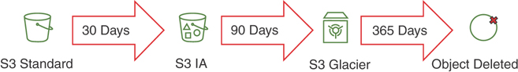

# Chapter 4 Storing Data in AWS

## STORING STATIC ASSETS IN AWS


### Amazon S3

1. Two different ways of allowing access to S3 bucket

    * **Use an access control list (ACL) or a bucket ACL:** quickly allow access to a large group of users,
      such as another account or everyone with a specific type of access to all the keys in the bucket.

    * **Use a bucket policy:** A bucket policy can be used to granularly control access to a bucket and its contents.

### Working with S3 in the AWS CLI

* AWS create-bucket

```
    aws s3api create-bucket --bucket bucket-name --region region-id

    aws s3 cp /my-website/ s3://everyonelovesaws/ --recursive 
    --exclude "*" --include "*.html"
```
    
* Access content within a bucket on S3

```
    http{s}://s3.{region-id}.amazonaws.com/{bucket-name}/{optional key
    prefix}/{key-name}
```

* Bucket names are globally unique. Because every bucket name is essentially a subdomain of 
   **.s3.amazonaws.com**, there is no way to make two buckets with the same name in all of AWS.

* Securing a static website through HTTPS with a free certificate attached to a **CloudFront distribution.**

* There are three status options: Disabled, Enabled, and Suspended. By default, a bucket has versioning disabled, 
but once it is enabled, it cannot be removed but only suspended.

### S3 Storage Tiers

* s3 has six storage classes:
    1. **S3 Standard**: General-purpose online storage with 99.99% availability and 99.999999999% durability (that is, “11 9s”).

    2. **S3 Infrequent Access**: Same performance as S3 Standard but up to 40% cheaper with 99.9% availability SLA and the same “11 9s” durability.

    3. **S3 One Zone-Infrequent Access**: A cheaper data tier in only one availability zone that can deliver an additional 25% savings over S3 Infrequent Access. It has the same durability, with 99.5% availability.

    4. **S3 Reduced Redundancy Storage (RRS)**: Previously this was a cheaper version of S3 providing 99.99% durability and 99.99% availability of objects. RRS cannot be used in a life cycling policy and is now more expensive than S3 Standard.

    5. **S3 Glacier**: Less than one-fifth the price of S3 Standard, designed for archiving and long-term storage.

    6. **S3 Glacier Deep Archive**: Costs four times less than Glacier and is the cheapest storage solution, at about $1 per terabyte per month. This solution is intended for very long-term storage.

* Data Life Cycling

<br></br>

### S3 Security

* There are three ways to grant access to an S3 bucket:
     1. **IAM policy**: You can attach IAM policies to users, groups, or roles to allow granular control over different levels of access (such as types of S3 API actions, like GET, PUT, or LIST) for one or more S3 buckets.
     2. **Bucket policy**: Attached to the bucket itself as an inline policy, a bucket policy can allow granular control over different levels of access (such as types of S3 API actions, like GET, PUT, or LIST) for the bucket itself.
     3. **Bucket ACL**: Attached to the bucket, an access control list (ACL) allows coarse-grained control over bucket access. ACLs are designed to easily share a bucket with a large group or anonymously when a need for read, write, or full control permissions over the bucket arises.


* To encrypt data at rest, you have three options in S3:
  
    1. **S3 Server-Side Encryption (SSE-S3)**: SSE-S3 provides built-in encryption with an AWS managed encryption key. This service is available on an S3 bucket at no additional cost.

    2. **S3 SSE-KMS**: SSE-KMS protects data by using a KMS-managed encryption key. This option gives you more control over the encryption keys to be used in S3, but the root encryption key of the KMS service is still AWS managed.

    3. **S3 SSE-C**: With the SSE-C option, S3 is configured with server-side encryption that uses a customer-provided encryption key. The encryption key is provided by the client within the request, and so each blob of data that is delivered to S3 is seamlessly encrypted with the customer-provided key. When the encryption is complete, S3 discards the encryption key so the only way to decrypt the data is to provide the same key when retrieving the object.
   

## DEPLOYING RELATIONAL DATABASES IN AWS

### Supported Database Types

* Currently the RDS service supports six different database engines that can be deployed from RDS:
    1. MySQL
    2. MariaDB
    3. PostgreSQL
    4. Amazon Aurora
    5. Oracle
    6. Microsoft SQL Serve

### Scaling Databases

* There are four general ways to scale database performance:

    1. **Vertical scaling**: You can give a single database engine more power by adding more CPU and RAM.

    2. **Horizontal scaling**: You can give a database cluster more power by adding more instances.

    3. **Read offloading**: You can add read replicas and redirect read traffic to them.

    4. **Sharding**: You can distribute the data across multiple database engines, with each one holding one section, or shard, of data.


## HANDLING NONRELATIONAL DATA IN AWS

* DynamoDB: A NoSQL key/value storage back end that is addressable via HTTP/HTTPS
* ElastiCache: An in-memory NoSQL storage back end
* DocumentDB: A NoSQL document storage back end
* Neptune: A NoSQL graphing solution for storing and addressing complex networked datasets
* Redshift: A columnar data warehousing solution that can scale to 2 PB per volume
* Redshift Spectrum: A serverless data warehousing solution that can address data sitting on S3
* TimeStream: A time series recording solution for use with IoT and industrial telemetry
* Quantum Ledger: A ledger database designed for record streams, banking transactions, and so on

### Amazon DynamoDB

* The MySQL, MariaDB, and PostgreSQL engines all have similar general characteristics and support highly available Multi-AZ deployment topologies with a synchronous master/slave pair across two availability zones. All of them also have the ability to deploy multiple read replicas in the same region or in another region.

### Secondary Indexes

* **Local secondary index (LSI)**: The LSI can be considered an additional sort key for sifting through multiple entries of a certain primary key. This is very useful in applications where two ranges (the sort key and the secondary index) are required to retrieve the correct dataset. The LSI consumes some of the provisioned capacity of the table and can thus impact your performance calculations in case it is created.

* **Global secondary index (GSI)**: The GSI can be considered an additional primary key on which the data can be accessed. The GSI allows you to pivot a table and access the data through the key defined in the GSI and get a different view of the data. The GSI has its own provisioned read and write capacity units that can be set completely independently of the capacity units provisioned for the table

### Planning for DynamoDB Capacity

* When calculating capacities, you need to set both the read capacity units (RCUs) and write capacity units (WCUs):

    1. One RCU represents one strongly consistent 4 KB or two eventually consistent 4 KB reads.

    2. One WCU represents one write request of up to 1 KB in size.


## CACHING DATA IN AWS

### Amazon ElastiCache

* ElastiCache is a managed service that helps simplify the deployment of in-memory data stores in AWS.