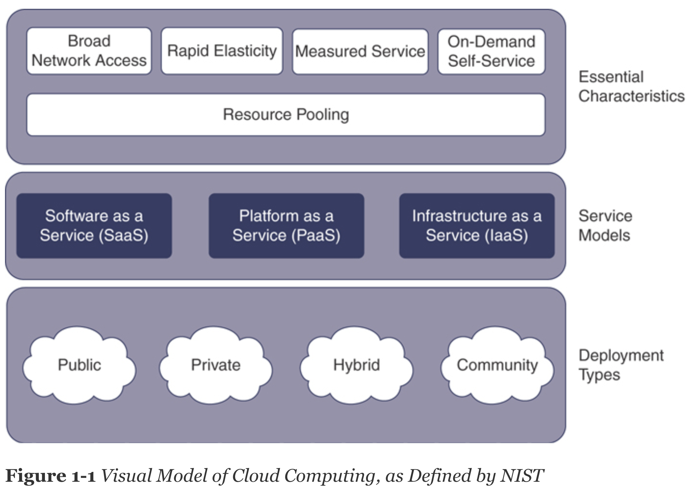

# Chapter 1

## QUIZ

1. Which of these is not a feature of cloud computing, as defined by the National Institute of Standards and Technology (NIST)?

    * Rapid elasticity

    * Self-service capability

    * Application agility

    * Broad network access

2. Which of the following is AWS responsible for?

    * Updating the EC2 operating system

    * Securing the hypervisor

    * Encrypting RDS databases

    * Configuring security group rules

3. Which of these services is designed with unlimited storage capacity?

    * RDS

    * S3

    *  EBS

    * An EC2 instance store volume

4. When is an RDS database considered highly available?

    * Always. An RDS database is inherently highly available.

    * Only when an RDS database is replicated to another database on the same instance.

    * Only when an RDS database has replicas in the same availability zone.

    * Only when an RDS database has replicas in two availability zones.

5. When accessing AWS, which of these is true?

    * All calls to AWS are API calls, regardless of the access method.

    * Calls through the CLI are API calls, whereas calls through the Management Console and the SDK are direct invocations.

    * Calls through the CLI and the SDKs are API calls, whereas calls through the Management Console are direct invocations.

    * Calls through the SDK are API calls, whereas calls through the Management Console and the CLI are direct invocations.

6. Which of these services gives you the ability to run virtual machines in the cloud?

    * VMM

    * Systems Manager

    * Lambda

    * EC2

7. Which of these responsibilities are customers responsible for? (Choose two.)

    * Creating and managing SSH keys

    * Securing the hypervisor

    * Enabling HTTPS on the Apache server

    * Decommissioning storage devices

8. Which of the following most accurately describes IaaS in the cloud?

    * Compute, networking, storage, and platforms in the datacenter

    * Compute, networking, and storage solutions across a VPN

    * Compute, networking, and storage solutions as a service

    * Compute, networking, storage, and platforms as a service

9. You can access AWS services through the API by using the following credentials:

    * An IAM-generated SSH secret key and public key

    * An IAM-generated username and password

    * An IAM-generated API secret key and API key

    * An IAM-generated secret key and an access key ID

10. What is the smallest component of the AWS global architecture?

    * A hypervisor

    * A datacenter

    * An availability zone

    * A region

## Foundation Topics

### NIST
NIST defines three delivery models that indicate how a service is consumed and determine the level of interaction the user has with the underlying compute services:

***IaaS: Infrastructure as a Service***

***PaaS: Platform as a Service***

***SaaS: Software as a Service***

<br></br>


#### Levels of shared responsibility in IaaS, PaaS, and SaaS

**Infrastructure as a Service (IaaS)**

The provider is responsible for

* Securing the hardware in the datacenter

* Securing the hypervisor

* Securing the storage subsystems

* Securing the physical network devices in the datacenter

* Securing the uplink to the Internet and the uplinks between the datacenters

The consumer is responsible for

* Securing the operating system user and network access (firewall, users, ports, key pairs, and so on)

* Ensuring that the operating system and application are updated

* Deploying and managing the database application

* Securing the database application from unauthorized access

* Securing the database content from unauthorized access


**Platform as a Service (PaaS))**

The provider is responsible for

* Securing the hardware in the datacenter

* Securing the hypervisor

* Securing the storage subsystems

* Securing the physical network devices in the datacenter

* Securing the uplink to the Internet and the uplinks between the datacenters

* Securing the operating system user and network access (firewall, users, ports, key pairs, and so on)

* Ensuring that the operating system and application are updated

* Deploying and managing the database application

* Securing the database application from unauthorized access

### AWS SERVICES

AWS defines two service types: the Foundation services and the Platform services.

#### Foundation Services

AWS Foundation services include all the IaaS services available in AWS and can be divided into several functional groups:

* Network services
* Compute services
* Storage services
* Security and identity services
* End-user applications

#### Network Services

The network services allow your application’s components to interact with each other and also connect your application to the Internet and private networks. Examples of network services include the following:

* ***Amazon Virtual Private Cloud (VPC)***: Allows you to connect your application with private network ranges, connect those private ranges with the Internet, and assign public IP addresses

* ***AWS Direct Connect***: A private optical fiber connection service that connects your on-premises sites with AWS

* ***AWS Virtual Private Gateway***: A component of VPC that provides the capability for establishing VPN connection with your on-premises sites

* ***Amazon Route 53***: The next-generation, API-addressable Domain Name Service (DNS) from AWS

* ***Amazon CloudFront***: The caching and Content Delivery Network (CDN) service in the AWS cloud

* ***Amazon Elastic Load Balancing (ELB)***: Allows load balancing of traffic across AWS Elastic Compute Cloud (EC2) instances, AWS Elastic Container Service (ECS) containers, or other IP addressable targets

#### Compute Services

You have a lot of flexibility when it comes to compute services in AWS. The following are examples of compute offerings in AWS:

* ***Amazon Elastic Cloud Computing (EC2)***: Provides the ability to deploy and operate virtual machines running Linux and Windows in the AWS cloud

* ***Amazon Elastic Container Service (ECS)***: Provides the ability to deploy, orchestrate, and operate containers in the AWS cloud

* ***Amazon Elastic Kubernetes Service (EKS)***: Provides the ability to deploy, orchestrate, and operate Kubernetes clusters in the AWS cloud

* ***Amazon Lambda***: Provides the ability to process simple functions in the AWS cloud

#### Storage Services
There are many types of data, and for each type you need to choose the right storage solution. In the AWS cloud, you have several different storage options, depending on the types of data you are storing. Here are a few examples:

* ***Amazon Elastic Block Storage (EBS)***: EBS provides block-accessible, network attached, persistent storage for volumes that you can connect to EC2 instances and ECS containers.

* ***Amazon Elastic File System (EFS)***: EFS provides a network attached file system that supports the Linux Network File System protocol (NFS) and allows you to share files among EC2 instances, ECS containers, and other services.

* ***Amazon Simple Storage Service (S3)***: Designed to store unlimited amounts of data, S3 is the ultimate object storage system. All objects in S3 are accessible via standard HTTP methods.

* ***Amazon Glacier***: This archiving storage solution can be automatically integrated with S3.

* ***AWS Storage Gateway***: This hybrid storage solution exposes AWS as a storage back end to your on-premises servers.

* ***AWS SnowBall and SnowMobile***: These data transfer devices allow for physically moving data from on premises to the cloud at any scale

## Q & A

1. Complete this sentence: A fault isolation environment that is composed from one or more datacenters in AWS is called a(n) **availability zone**

2. Complete this sentence: To replicate a corporate network, a cloud customer would use the **IaaS** service model, as defined by NIST.

3. Complete this sentence: **Route 53** is the next-generation DNS service available from AWS.

4. What is the most important security recommendation when opening an AWS account? 

**Answer**:  Stop using the root account for everyday tasks.

5. What type of access to AWS can you gain with a secret key and an access key ID?
    
**Answer**:  Programmatic access

6. What happens when you run the help command in the CLI?

**Answer**: The man page of the AWS CLI, the service, or the operation is displayed.

7. What are the three components of the AWS CLI model?

**Answer**:  The service, operation, and options

8. Name two API method types are available in some SDKs.

**Answer**:  Client and resource APIs

9. What does the following command do? 

```aws ec2 describe-instances --profile developer01```

**Answer**: It runs a **describe-instances** operation on the EC2 service with the credentials and configuration defined in the developer01 profile under the **developer01** section in the files.

10. What option can you use to override the default output of the AWS CLI?

**Answer**: --output text|json|table